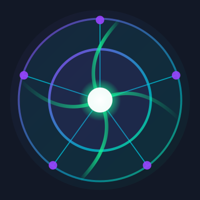

# Calctra

<div align="center">
  
</div>

## A Decentralized Revolutionary Platform Reshaping the Scientific Computing Ecosystem

Calctra is dedicated to fundamentally restructuring the acquisition, utilization, and value distribution of scientific computing resources through blockchain technology, artificial intelligence, and innovative economics. Our vision is to create a decentralized, efficient, and fair scientific computing ecosystem, providing unprecedented access to computing resources for researchers worldwide.

## Project Overview

At a critical moment in human technological development, computing power has become a decisive factor in driving innovation. However, the current scientific computing ecosystem faces severe structural challenges: highly concentrated computing resources, high acquisition costs, and limited innovation, which seriously hinder the release of global research potential.

Calctra solves these problems by creating a decentralized marketplace where resource providers can monetize their idle computing capacity and researchers can access these resources at competitive prices, with intelligent matching and privacy-preserving computation guarantees.

## Core Functions

- **Decentralized Resource Pool**: Integrating globally dispersed computing resources, enabling dynamic and elastic resource scheduling
- **Intelligent Resource Matching Engine**: AI-driven resource allocation algorithm, offering real-time, dynamic resource optimization
- **Privacy Computing Framework**: Based on homomorphic encryption technology, ensuring the security and privacy of data usage
- **CAL Token Ecosystem**: Innovative economic model, incentivizing resource sharing and value distribution

## Technology Architecture

Calctra is built on a multi-layered architecture that combines blockchain, microservices, and front-end technologies:

### 1. Blockchain Layer
- **Solana Blockchain**: Core ledger for transactions and smart contracts
- **Smart Contracts**: Resource matching, payment processing, and data verification
- **CAL Token**: Native utility token for ecosystem transactions

### 2. Backend Layer
- **Node.js/Express**: RESTful API services and business logic
- **MongoDB**: Persistent storage for user data and metadata
- **Redis**: Cache layer for performance optimization
- **Homomorphic Encryption Service**: Privacy-preserving computation

### 3. Frontend Layer
- **React.js**: Single page application with responsive design
- **Material-UI**: Component library for consistent UI/UX
- **Redux**: State management across application
- **Web3.js/Solana-Web3**: Blockchain interaction

### 4. DevOps
- **Docker**: Containerization of services
- **CI/CD Pipeline**: Automated testing and deployment
- **Monitoring & Logging**: System health and performance tracking

## System Architecture Diagram

```
┌─────────────────────────────────────────────────────────────┐
│                      CLIENT APPLICATIONS                     │
│                                                             │
│  ┌──────────┐   ┌──────────┐   ┌──────────┐   ┌──────────┐  │
│  │  Web App │   │Mobile App│   │   CLI    │   │  API SDK │  │
│  └────┬─────┘   └────┬─────┘   └────┬─────┘   └────┬─────┘  │
└───────┼───────────────┼────────────┼───────────────┼────────┘
         │               │            │               │        
┌────────▼───────────────▼────────────▼───────────────▼───────┐
│                         API GATEWAY                         │
└────────┬───────────────┬────────────┬───────────────┬───────┘
         │               │            │               │        
┌────────▼───────┐ ┌─────▼──────┐ ┌───▼────┐  ┌───────▼───────┐
│ Authentication │ │ Resource   │ │ Job    │  │ Data          │
│ Service        │ │ Service    │ │ Service│  │ Service       │
└────────┬───────┘ └─────┬──────┘ └───┬────┘  └───────┬───────┘
         │               │            │               │        
┌────────▼───────────────▼────────────▼───────────────▼───────┐
│                      DATABASE LAYER                          │
│  ┌──────────┐   ┌──────────┐   ┌──────────┐   ┌──────────┐  │
│  │ User DB  │   │Resource DB│   │  Job DB  │   │  Data DB │  │
│  └──────────┘   └──────────┘   └──────────┘   └──────────┘  │
└─────────────────────────────────────────────────────────────┘
                            │                                   
┌───────────────────────────▼───────────────────────────────┐  
│                    BLOCKCHAIN LAYER                        │  
│  ┌─────────────┐  ┌─────────────┐  ┌─────────────────┐    │  
│  │ CAL Token   │  │ Resource    │  │ Payment         │    │  
│  │ Contract    │  │ Matching    │  │ Processing      │    │  
│  └─────────────┘  └─────────────┘  └─────────────────┘    │  
└─────────────────────────────────────────────────────────────┘
```

## Core Modules

### User Management
- User registration and authentication
- Profile management
- Wallet integration
- Reputation system

### Resource Management
- Resource registration and verification
- Resource availability scheduling
- Pricing model configuration
- Resource monitoring

### Job Processing
- Job creation and configuration
- Resource allocation and matching
- Job execution and monitoring
- Result verification and delivery

### Data Management
- Secure data storage and sharing
- Access control and permissions
- Privacy-preserving computation
- Data marketplace functionality

## Workflow Diagram

```
┌─────────────┐     ┌─────────────┐     ┌─────────────┐
│  Resource   │     │    User     │     │  Platform   │
│  Provider   │     │ (Researcher)│     │   System    │
└──────┬──────┘     └──────┬──────┘     └──────┬──────┘
       │                   │                   │       
       │  Register         │                   │       
       │ Resources         │                   │       
       ├──────────────────►│                   │       
       │                   │  Create           │       
       │                   │  Job              │       
       │                   ├──────────────────►│       
       │                   │                   │       
       │                   │                   │ Match 
       │                   │                   │ Resources
       │                   │                   │       
       │  Job              │                   │       
       │  Assignment       │                   │       
       │◄──────────────────┼───────────────────┤       
       │                   │                   │       
       │  Accept           │                   │       
       │  Job              │                   │       
       ├───────────────────┼──────────────────►│       
       │                   │                   │       
       │  Process          │                   │       
       │  Job              │                   │       
       ├───────────────────┼──────────────────►│       
       │                   │                   │       
       │  Complete         │                   │       
       │  Job              │                   │       
       ├───────────────────┼──────────────────►│       
       │                   │  Deliver          │       
       │                   │  Results          │       
       │                   │◄──────────────────┤       
       │                   │                   │       
       │  Token            │                   │       
       │  Payment          │                   │       
       │◄──────────────────┼───────────────────┤       
       │                   │                   │       
       │  Rate             │                   │       
       │  Experience       │                   │       
       │◄──────────────────┤                   │       
       │                   │                   │       
```

## Project Status and Roadmap

### Current Status (Phase 1: Alpha) - Q1 2025
- ✅ Core platform architecture defined
- ✅ Smart contract development (Solana)
- ✅ Basic user authentication
- ✅ Resource registration functionality
- ✅ Simple job creation and execution
- ✅ MVP frontend implementation

### Phase 2: Beta - Q3 2025
- 🔄 Enhanced resource matching algorithm
- 🔄 Reputation system implementation
- 🔄 Privacy-preserving computation framework
- 🔄 Data marketplace functionality
- 🔄 Advanced payment mechanisms

### Phase 3: Production - Q1 2026
- 📅 Full decentralized governance
- 📅 Cross-chain integration
- 📅 Advanced analytics and reporting
- 📅 Enterprise-grade security features
- 📅 Developer API and SDK

### Phase 4: Expansion - Q3 2026
- 📅 Multi-language support
- 📅 Mobile applications
- 📅 Industry-specific solutions
- 📅 Research partnerships
- 📅 Global resource network expansion

## Unique Selling Points

- **True Decentralization**: Unlike centralized cloud providers, Calctra offers a fully decentralized marketplace
- **Dynamic Pricing Model**: Algorithmic pricing based on supply, demand, and compute requirements
- **Privacy Guarantees**: Homomorphic encryption enables computation on encrypted data
- **Fair Economic Model**: Transparent token distribution and value capture for all participants
- **Scientific Focus**: Specialized for scientific and research computing needs
- **Resource Efficiency**: Optimized utilization of idle computing resources globally

## Getting Started

### Prerequisites

- Node.js (v14 or later)
- MongoDB (v4.4 or later)
- Solana CLI tools (for blockchain interaction)
- Git

### Installation

1. Clone the repository:
   ```bash
   git clone https://github.com/Calctra/Calctra.git
   cd calctra
   ```

2. Install backend dependencies:
   ```bash
   npm install
   ```

3. Install frontend dependencies:
   ```bash
   cd web
   npm install
   cd ..
   ```

4. Create environment variables:
   ```bash
   cp .env.example .env
   ```
   Edit the `.env` file with your configuration details.

5. Start MongoDB (if running locally):
   ```bash
   mongod
   ```

### Development

To run the application in development mode:

1. Start the backend server:
   ```bash
   npm run dev
   ```

2. In a separate terminal, start the frontend:
   ```bash
   cd web
   npm start
   ```

3. The application will be available at `http://localhost:3000`

### Docker Deployment

For containerized deployment:

```bash
docker-compose up -d
```

This will start the MongoDB, backend, and frontend services as defined in the `docker-compose.yml` file.

## API Documentation

Our RESTful API provides endpoints for:

- User authentication and management
- Resource registration and discovery
- Job submission and monitoring
- Data upload, management, and sharing

For detailed API documentation, see the [API Reference](docs/api-reference.md).

## Smart Contract Integration

Calctra leverages Solana blockchain for:

- Resource registration and verification
- Decentralized resource matching
- Token-based payments and incentives
- Reputation and trust mechanisms

For details on smart contract integration, see [Smart Contracts Documentation](docs/smart-contracts.md).

## Project Structure

```
calctra/
├── src/                # Backend source code
│   ├── api/            # API routes and controllers
│   ├── blockchain/     # Blockchain integration
│   ├── core/           # Core services (matcher, encryption)
│   ├── models/         # Data models
│   └── utils/          # Utility functions
├── web/                # Frontend application
│   ├── public/         # Static assets
│   └── src/            # React components and logic
├── docs/               # Documentation
├── tests/              # Test suites
└── scripts/            # Utility scripts
```

## Connect With Us

- **Website**: [https://calctra.fun/](https://calctra.fun/)
- **Twitter**: [https://x.com/calctra_sol](https://x.com/calctra_sol)
- **GitHub**: [https://github.com/Calctra/Calctra](https://github.com/Calctra/Calctra)

## Contributing

We welcome contributions from the community! Please see our [Contributing Guidelines](CONTRIBUTING.md) for more information.

## License

This project is licensed under the MIT License - see the [LICENSE](LICENSE) file for details.

## Contact

For questions or support, please contact the development team at team@calctra.com or open an issue on GitHub. 